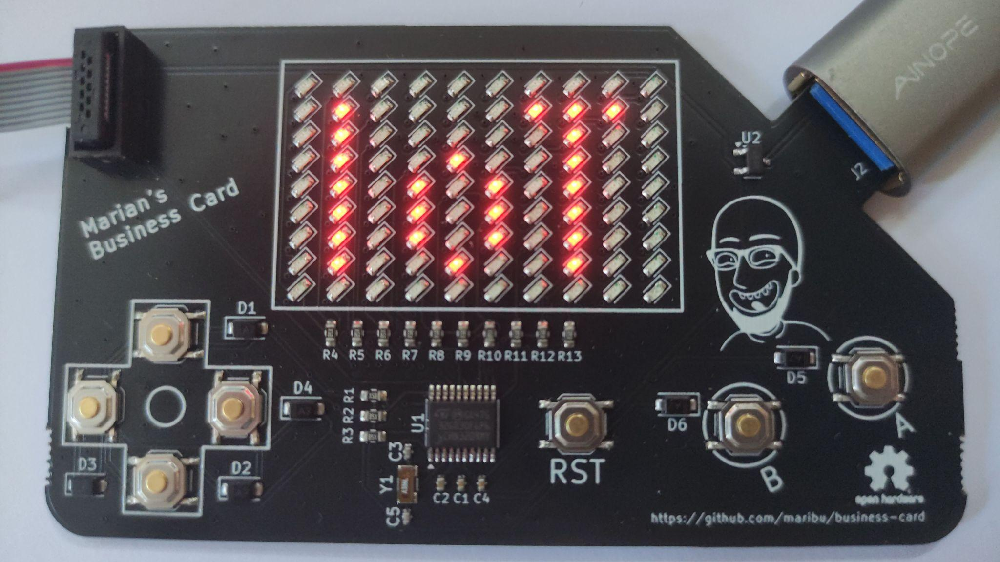
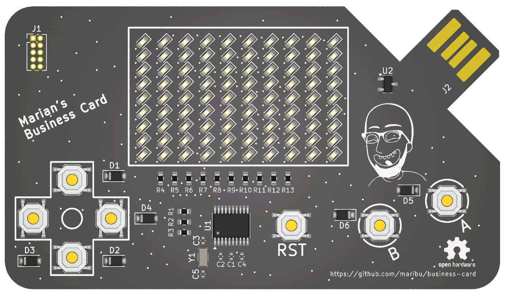

# Marian's Business Card

This repository contains an open hardware business card running open source
software.

## Getting started

### Hardware

Using KiCad, add Silkscreen details such as your name. E.g. I added my contact
details and word cloud of my skills on the back of the PCB. Using the JLCPCB
fabrication plugin of KiCAD, you can export the production files to directly
order the PCBs.

Note that when using vanilla PCB options (1.6 mm PCB thickness, HASL surface
finish) the USB connector will be a tad too thin to perfectly make contact with
a USB socket. Ideally you would use 2.0 mm PCB thickness and ENIG surface
finish, but that would be so expensive that it defeats the purpose of a
business card. Instead, you can just add a bit of solder on the USB contacts to
increase the thickness.

### Software

A simple "hello world" demo is given in
`software/RIOT-based-apps/apps/hello-world` that you can flash using e.g. a
J-Link EDU Mini programmer. Rather than using a cable, just plug the pins of
the J-Link EDU Mini programmer from the underside through the holes and rotate
the programmer until the pins and holes have contact. In addition, you need to
power the board (ideally via a USB-A extension cord).

With the programmer connected and the board powered, simply run:

    make flash

Refer to the [RIOT documentation](https://doc.riot-os.org/) for more details on
the software.
